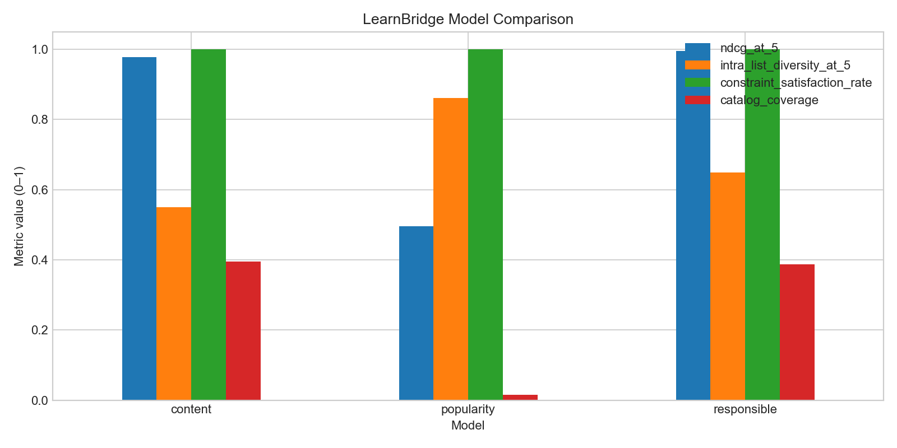
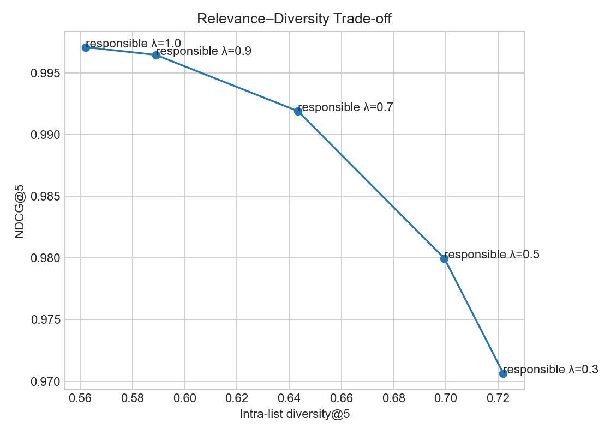

# LearnBridge: Responsible Learning Resource Recommender

[](https://github.com/OWNER/learnbridge/actions/workflows/ci.yml)

LearnBridge is a deployment-ready educational recommendation prototype that balances relevance with knowledge-gap coverage, diversity, quality, accessibility, time, budget, and provider exposure. It serves cold-start learners from an onboarding profile—no interaction history, tracking, API key, or GPU is required.

**AI-use attribution:** OpenAI Codex assisted with project scaffolding, implementation, documentation, and original synthetic text templates. See the full [AI-use attribution](#ai-use-attribution). No third-party application code or course descriptions were copied.

> **Educational prototype disclaimer:** LearnBridge uses synthetic data and does not replace teachers, academic advisors, or professional training guidance.

## Why this matters

A click- or popularity-driven learning feed can repeatedly surface the same providers and overlook the learner's level, missing foundations, available time, budget, and accessibility needs. LearnBridge makes those considerations explicit, auditable, and measurable.

## Architecture

```text
Cold-start onboarding profile
          │
          ├── Model A: global quality + popularity
          │
          └── TF-IDF profile query → 30 candidates (Model B)
                                    │
                         hard constraint filtering
                         budget · captions · level
                                    │
                  relevance + gaps + quality + accessibility
                                    │
                     exploration-controlled MMR + provider cap
                                    │
                    responsible top five (Model C)
                                    │
                 grounded deterministic explanations by default
```

The responsible score uses normalized components:

```text
0.60 relevance + 0.15 knowledge-gap coverage + 0.10 quality
+ 0.10 diversity contribution + 0.05 accessibility
```

Weights, candidate count, MMR default, seed, and provider cap are centralized in `src/learnbridge/config.py`. Higher exploration lowers the effective MMR relevance weight, admitting more novelty. A provider may occupy at most two positions in the final top five.

## Data

`scripts/make_dataset.py` deterministically creates:

- 600 original synthetic educational resources across 12 domains, 7 formats, 3 levels, and 18 fictional providers;
- 72 cold-start learner profiles;
- 43,200 graded profile-resource judgments (`0`, `1`, `2`);
- raw JSONL, processed CSV, and a dataset metadata manifest.

Descriptions are generated original text, not copied course descriptions. URLs use `example.org` and are illustrative. The data is suitable only for prototype evaluation.

## Models

| Model | Behavior | Purpose |
|---|---|---|
| A: Popularity | Ranks global quality and popularity, then respects hard constraints | Exposes low personalization and narrow catalog coverage |
| B: TF-IDF | A fitted and persisted `TfidfVectorizer` + cosine similarity over title, description, topics, difficulty, format, prerequisites | Simple explainable personalized inference |
| C: Responsible hybrid | Model B candidates + constraints + gap/quality/accessibility scores + MMR + provider cap | Balances relevance with responsible behavior |

Filtering returns a reason for every rejected item. Beginners do not receive advanced items unless exploration is high and prerequisites are satisfied. Duration contributes as a preference because strict time exclusion can eliminate useful multi-session courses.

## Computed evaluation results

These results were computed by `scripts/evaluate.py` from seed-42 synthetic data; they are not hand-entered claims. Re-run `make evaluate` to reproduce the CSV, JSON, and figures.

| Metric | Popularity | TF-IDF | Responsible hybrid |
|---|---:|---:|---:|
| Precision@5 | 0.794 | **1.000** | **1.000** |
| Recall@5 | 0.011 | **0.016** | **0.016** |
| NDCG@5 | 0.496 | 0.977 | **0.995** |
| Mean relevance@5 (0–2) | 1.117 | 1.958 | **1.992** |
| Intra-list diversity@5 | **0.861** | 0.550 | 0.649 |
| Format diversity@5 | 0.600 | 0.617 | **0.725** |
| Provider diversity@5 | 0.814 | **0.900** | 0.894 |
| Constraint satisfaction | 1.000 | 1.000 | 1.000 |
| Knowledge-gap coverage | 0.560 | 0.968 | **1.000** |
| Catalog coverage | 0.015 | **0.395** | 0.387 |
| Long-tail exposure | 0.000 | 0.472 | **0.500** |

Recall is low because hundreds of resources are marked at least partially relevant while only five can be returned. Popularity happens to show high text diversity because global popular items span unrelated subjects; its NDCG, gap coverage, catalog coverage, and long-tail exposure reveal why diversity without personalization is not sufficient.





Additional generated charts cover constraint satisfaction, catalog coverage, and provider exposure. `data/outputs/example_before_after.json` holds same-profile lists for the pitch.

## Evaluation coverage

The evaluator computes Precision@5, Recall@5, NDCG@5, mean relevance@5, intra-list/topic/format/provider diversity@5, catalog coverage, constraint satisfaction, knowledge-gap coverage, average popularity, long-tail exposure, and provider exposure distribution. It repeats the responsible system at MMR lambda values `1.0`, `0.9`, `0.7`, `0.5`, and `0.3`.

## Optional LoRA adaptation and before/after comparison

The language model never replaces retrieval. `scripts/finetune.py` builds synthetic instructions containing the learner profile, candidate metadata, constraints, correct ranking, grounded explanations, and explicit hard-constraint rejections. It defaults to `Qwen/Qwen2.5-0.5B-Instruct`, PEFT LoRA, Transformers, Datasets, and TRL.

Validate the entire training-data path without downloading anything:

```bash
PYTHONPATH=src python scripts/finetune.py --dry-run
```

For real training:

```bash
pip install -r requirements-train.txt
PYTHONPATH=src python scripts/finetune.py \
  --base-model Qwen/Qwen2.5-0.5B-Instruct \
  --output-dir models/learnbridge-lora \
  --epochs 1 --learning-rate 2e-4 --batch-size 1
```

Only adapter and tokenizer files are saved. Base-model binaries and adapters are ignored by Git. The deployed app uses deterministic, metadata-only templates unless `LEARNBRIDGE_ENABLE_LLM=1` and an adapter directory exists.

`scripts/evaluate_llm.py` compares real base and adapted JSONL outputs for constraint following, groundedness, ranking relevance, and unsupported-claim rate. Running it without both files creates an explicit `computed: false` result. No fine-tuning improvement is claimed in this repository because no actual training run was performed.

```bash
PYTHONPATH=src python scripts/evaluate_llm.py \
  --base-results path/to/base.jsonl \
  --adapted-results path/to/adapted.jsonl
```

Explanations are restricted to dataset metadata and must not invent certificates, instructor credentials, ratings, learning outcomes, accreditation, medical/employment/salary guarantees, or any unsupported claim.

## Quick start

Python 3.10–3.12 is recommended.

```bash
git clone https://github.com/OWNER/learnbridge.git
cd learnbridge
python -m venv .venv
source .venv/bin/activate
make install
make all
make app
```

Individual commands:

```bash
PYTHONPATH=src python scripts/make_dataset.py
PYTHONPATH=src python scripts/build_features.py
PYTHONPATH=src python scripts/model.py
PYTHONPATH=src python scripts/evaluate.py
PYTHONPATH=src python scripts/finetune.py --dry-run
pytest -q
streamlit run main.py
```

`main.py` automatically builds deterministic data and TF-IDF artifacts when missing. If initialization fails, it shows the exact recovery command. Streamlit caching keeps resources and vectors warm.

The trained artifact `models/tfidf_features.joblib` is committed so the application performs inference immediately after cloning. `make features` reproducibly retrains it. The optional LoRA adapter is not required for application inference.

## Deployment

### Streamlit Community Cloud

Push the repository, choose `main.py` as the entry point, and use Python 3.11. No secrets or model download are needed.

### Hugging Face Spaces / Docker

Choose a Docker Space and deploy this repository. The included image starts:

```text
streamlit run main.py --server.address=0.0.0.0 --server.port=7860
```

Locally:

```bash
docker build -t learnbridge .
docker run --rm -p 7860:7860 learnbridge
```

## Repository map

```text
main.py                    Streamlit UI
src/learnbridge/           Package: retrieval, constraints, reranking, metrics, inference
scripts/                   Data, feature, model, evaluation, LoRA, and pitch pipelines
tests/                     20 deterministic unit/integration tests
data/outputs/              Computed CSV, JSON, and PNG evaluation artifacts
reports/                   Pitch outline, transcript, ethics and limitations
models/                    Generated TF-IDF and optional adapter artifacts
.github/workflows/ci.yml   Multi-version test workflow
```

## GitHub workflow

Create focused feature branches, open pull requests using the checklist, and require CI before merge. This is a solo project, so each PR includes a documented second-pass self-review; if independent approval is mandated, request an instructor, teaching assistant, or assigned peer because GitHub authors cannot approve their own PR. CI builds data/features and runs all tests on Python 3.10–3.12. Full instructions are in `CONTRIBUTING.md`. Replace the `OWNER` badge and clone placeholders after creating the public repository.

## Ethics, limitations, and future work

Synthetic judgments encode generation rules rather than real learning outcomes. Accessibility and quality values are simulated, provider fairness is limited to exposure balance, English is the only language, and no subgroup impact conclusion is possible. See `reports/ethics_and_limitations.md`.

Next steps are educator-reviewed judgments, real catalog ingestion, accessibility audits, multilingual support, consented longitudinal feedback, subgroup fairness evaluation, uncertainty estimates, and online outcome testing that does not optimize clicks alone.

## Five-minute pitch

Use `reports/pitch_outline.md`, the ready-to-deliver `reports/pitch_transcript.md`, the Streamlit comparison mode, generated figures, and `data/outputs/example_before_after.json`.

## AI-use attribution

Generative AI assisted with project scaffolding, implementation, documentation, and synthetic text templates. The project owner remains responsible for review, testing, deployment, claims, and license compliance. Generated synthetic descriptions are released with the project under the MIT License; no third-party course descriptions or model weights are included.

## License

MIT — see `LICENSE`.
